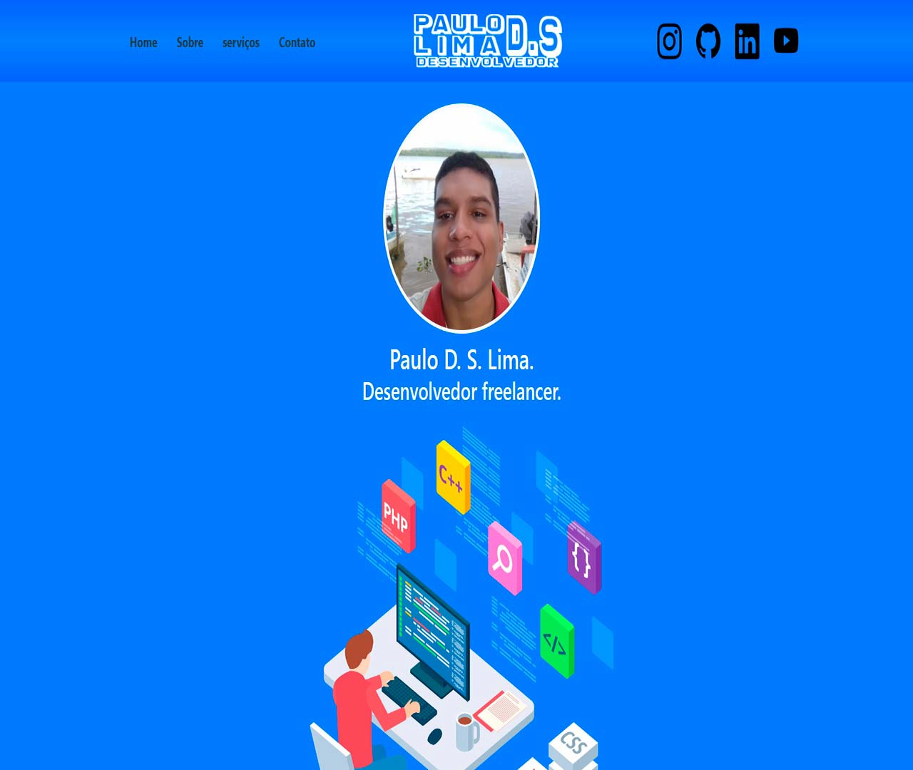
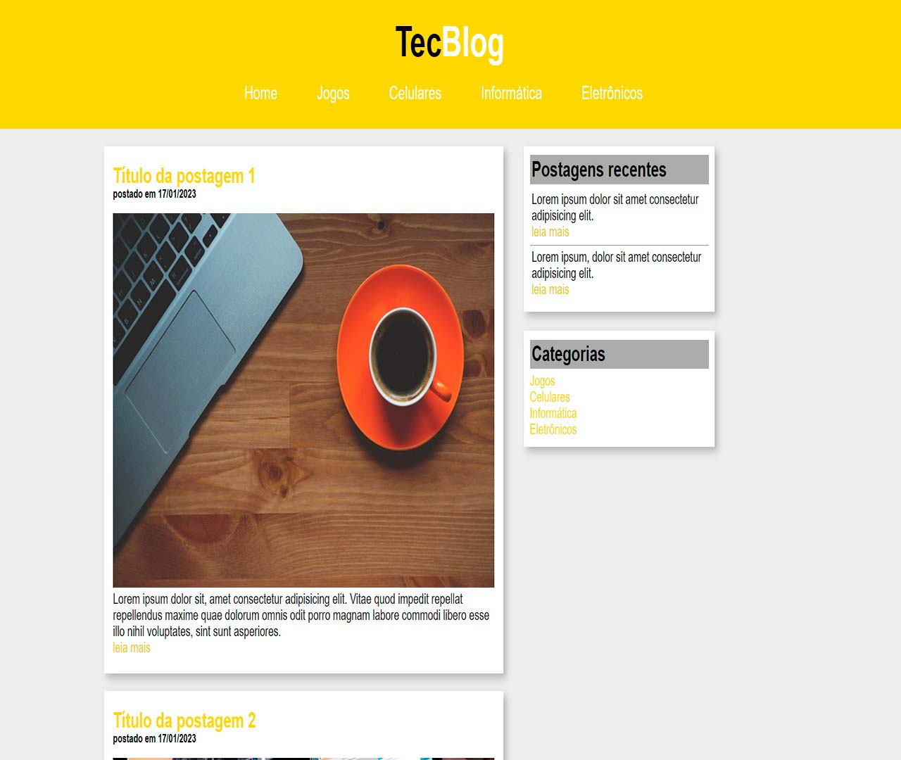

# 👋 Olá, eu sou Paulo Diego dos Santos

## 🚀 Sobre Mim
🎓 Sou técnico em Informática para Internet, formado pelo Instituto Federal de Alagoas (IFAL), e atualmente curso Análise e Desenvolvimento de Sistemas.

💻 Participante do Oracle Next Education (ONE), com foco em Back-End Java, buscando minha primeira oportunidade como Desenvolvedor de Software.

🛠️ Tenho experiência prática com Java, JavaScript, Node.js, React, HTML5, CSS3, Bootstrap, SQL, PHP e Python, além de bancos de dados como SQL Server e PostgreSQL.

📌 Certificado em Scrum, com vivência em metodologias ágeis, testes manuais, levantamento de requisitos e suporte técnico.

💡 Atualmente, estou desenvolvendo projetos próprios para consolidar meus conhecimentos e demonstrar minha evolução prática na área de tecnologia.

🌐 Inglês nível iniciante, em constante aprimoramento.

---

## 🔍 Interesses

Atualmente focado em me tornar **Desenvolvedor Back-End Java Júnior**, mas também com experiência prática em **Front-End**.

💡 Tecnologias:  
- **Back-End:** Java, Spring Boot (em aprendizado), SQL, PostgreSQL, SQL Server
- **Front-End:** HTML5, CSS3, JavaScript, Node.js, React, Bootstrap
- **Outros:** PHP, Python, Scrum, Git, GitHub

---

## 📂 Projetos

Aqui estão alguns dos meus projetos pessoais:

| Projetos |
| - |
|  |
|  |
|  |

> Em breve: novos projetos em Java e Spring Boot 🚀

---

## 🌐 Contato

📧 [paulodslima@outlook.com](mailto:paulodslima@outlook.com)  
🔗 [LinkedIn](https://www.linkedin.com/in/paulodiego/)  

💬 **Fique à vontade para entrar em contato ou me chamar para conversar sobre tecnologia!**

---

<!---
paulodslima/paulodslima is a ✨ special ✨ repository because its `README.md` (this file) appears on your GitHub profile.
--->
