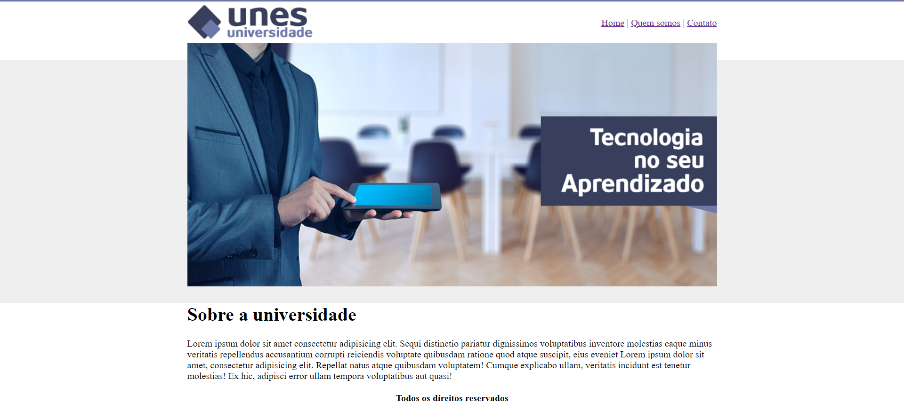

# Olá, Eu sou [Paulo Diego](https://github.com/paulodslima).

## Quem eu sou?

Aluno do 4° ano com status de formando no Instituto Federal de Alagoas (IFAL) no **curso de informática para internet integrado** e atualmente trabalhando como Suporte Técnico na empresa de automação comercial [OG1 SYSTEMS](https://www.og1.inf.br/).

## Interesses.

Estou interessado em **Desenvolvimento Web (HTML5, CSS e JavaScript)** com foco em confeccção de sites. Você pode encontrar alguns projetos meus a baixo.
|Projetos|
|-|
||

## Minhas informações.

- 📫 Você pode entrar em contato comigo mandando um email para **paulodslima@outlook.com**.

<!---
paulodslima/paulodslima is a ✨ special ✨ repository because its `README.md` (this file) appears on your GitHub profile.
You can click the Preview link to take a look at your changes.
--->
